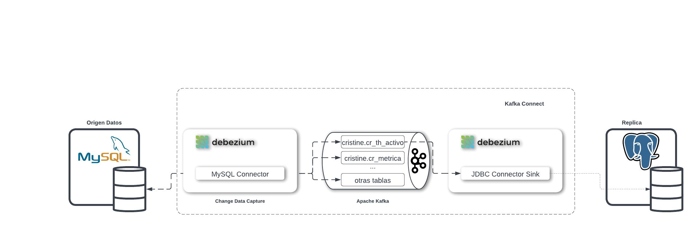

# Demo Change Data Capture (CDC) desde MySQL a Postgres usando Debezium

Utilizamos Docker Compose para configurar la infrastructura necesaria para la demo

- Postgres
- Mysql
- Kafka
  - Zookeeper.
  - Kafka Broker.
  - Kafka Connect con [Debezium](https://debezium.io/), [para Postgres utilizamos el conector JDBC](https://github.com/confluentinc/kafka-connect-jdbc).
  - kafdrop For UI to Kafka topics.

### 

## Ejecucion de la demo

Se ha creado un script para crear en el contenedor la tabla cris2.cr_th_activo en MySQL. Se encuentra en mysql/cris2.sql

Ejecutamos docker-compose para levantar la infrastructura arriba definida:

```shell
export DEBEZIUM_VERSION=2.1

# Construye los contenedores desde el fichero docker usando docker compose. Le lleva un poco de tiempo la primera vez que se ejecuta
docker-compose up --build

# Configure the connectors. For simplicity I created shell script.
# Configuramos los 2 conectores. Por simplicidad, se crea un script para desplegarlos
Run the following script to add the 2 connectors (one for the source MySQL database and another for the sink Postgres database)
Ejecuta el siguiente script para añadir los 2 conectores (uno para la fuente de datos en MySQL y otro para el destino de datos en Postgres)
./init.sh
```
### Comprobamos  MySQL

Comprobamos que la tabla `cr_th_activo` ha sido creada en MySQL

```shell
docker exec -it demo_cdc_crist_mysql_1 bash -c 'mysql -u mysql -p'
```
Nota: se nos solicitará la password del usuario mysql, que es 'mysql'

```sql
Enter password: 
Welcome to the MySQL monitor.  Commands end with ; or \g.
Copyright (c) 2000, 2023, Oracle and/or its affiliates.

mysql> show databases;
+--------------------+
| Database           |
+--------------------+
| information_schema |
| cris2              |
+--------------------+
2 rows in set (0.00 sec)

mysql> use cris2;
Database changed

mysql> show tables;
+-----------------+
| Tables_in_cris2 |
+-----------------+
| cr_th_activo    |
+-----------------+
1 row in set (0.00 sec)

mysql> describe cr_th_activo;
+-----------------------+---------------+------+-----+-------------------+-----------------------------+
| Field                 | Type          | Null | Key | Default           | Extra                       |
+-----------------------+---------------+------+-----+-------------------+-----------------------------+
| O5625_ID_UNIT         | char(10)      | NO   | PRI | NULL              |                             |
| O5625_ID_AREA         | char(10)      | NO   | PRI | NULL              |                             |
| O5625_ID_CARTERA      | char(10)      | NO   | PRI | NULL              |                             |
| O5625_FEC_DATO        | date          | NO   | PRI | NULL              |                             |
| O5625_ID_ISS_CTRY     | char(10)      | YES  |     | NULL              |                             |
| O5625_ID_COUNT_PT     | char(10)      | YES  |     | NULL              |                             |
| O5625_ID_UNDERLY      | char(10)      | YES  |     | NULL              |                             |
| O5625_ID_ASSETCL      | char(10)      | YES  |     | NULL              |                             |
| O5625_ID_BAL_SH_IT    | char(20)      | YES  |     | NULL              |                             |
| O5625_ID_CURRENCY     | char(10)      | YES  |     | NULL              |                             |
| O5625_ID_SEGMENT      | char(10)      | YES  |     | NULL              |                             |
| O5625_ID_PRODUCT      | char(10)      | YES  |     | NULL              |                             |
| O5625_ID_SCENARIO     | char(20)      | YES  |     | NULL              |                             |
| O5625_ID_FACT_TYPE    | char(20)      | YES  |     | NULL              |                             |
| O5625_ID_SOV_RSK      | char(10)      | YES  |     | NULL              |                             |
| O5625_ID_TYPE_FVA     | char(10)      | YES  |     | NULL              |                             |
| O5625_ID_CURVE        | char(20)      | YES  |     | NULL              |                             |
| O5625_ID_TB_ORIG      | char(10)      | YES  |     | NULL              |                             |
| O5625_ID_TIME_BUCK    | char(10)      | YES  |     | NULL              |                             |
| O5625_ID_AST_LIAB     | char(10)      | YES  |     | NULL              |                             |
| O5625_ID_FX_POS       | char(10)      | YES  |     | NULL              |                             |
| O5625_ID_METRICA      | int(11)       | YES  |     | NULL              |                             |
| O5625_ID_TIP_CALC     | int(11)       | YES  |     | NULL              |                             |
| O5625_COMENTARIO      | varchar(1000) | YES  |     | NULL              |                             |
| O5625_ESTADO_MET      | varchar(20)   | YES  |     | NULL              |                             |
| O5625_ID_USUARIO      | char(30)      | YES  |     | NULL              |                             |
| O5625_FEC_CARGA       | timestamp     | NO   |     | CURRENT_TIMESTAMP | on update CURRENT_TIMESTAMP |
| O5625_VAL_MET_EUR     | int(11)       | YES  |     | NULL              |                             |
| O5625_VAL_MET_ORIG    | int(11)       | YES  |     | NULL              |                             |
| O5625_IND_AJUSTE      | char(1)       | YES  |     | NULL              |                             |
| O5625_IND_TIP_CARG    | int(11)       | YES  |     | NULL              |                             |
| O5625_ID_DIV_CARGA    | char(3)       | YES  |     | NULL              |                             |
| O5625_IND_EST_REV     | int(11)       | YES  |     | NULL              |                             |
| O5625_ID_CAUSA_AJ     | int(11)       | YES  |     | NULL              |                             |
| O5625_ORIGEN_MET      | varchar(20)   | YES  |     | NULL              |                             |
| O5625_ID_T_ISSUER     | char(10)      | YES  |     | NULL              |                             |
| O5625_ID_INTRAGR      | char(10)      | YES  |     | NULL              |                             |
| O5625_FEC_REAL_DATO   | date          | YES  |     | NULL              |                             |
| O5625_IND_COPIADO     | int(11)       | YES  |     | NULL              |                             |
| O5625_VAL_MET_ORIG_OF | int(11)       | YES  |     | NULL              |                             |
| O5625_VAL_MET_EUR_OF  | int(11)       | YES  |     | NULL              |                             |
| O5625_ID_DIV_CARGA_OF | char(3)       | YES  |     | NULL              |                             |
+-----------------------+---------------+------+-----+-------------------+-----------------------------+
42 rows in set (0.00 sec)

mysql>exit;
```

### Verificamos el contenido en la instancia de Postgres DB

```shell
docker exec -it demo_cdc_crist_postgres_1 bash -c 'psql -U $POSTGRES_USER $POSTGRES_DB'
```

```sql
psql -U $POSTGRES_USER $POSTGRES_DB'
psql (9.6.22)
Type "help" for help.

inventoryDB=# \dt
            List of relations
 Schema |     Name     | Type  |  Owner   
--------+--------------+-------+----------
 public | cr_th_activo | table | postgres
(1 row)

```

### Insertamos un registro en la tabla origen en MySQL

Vamos a ejecutar un script en bash que creara un registro para la tabla con valores arbitrarios

```shell
docker exec -it demo_cdc_crist_mysql_1 bash -c 'bash /app/create_1_insert.sh'
docker exec -it demo_cdc_crist_mysql_1 bash -c 'mysql -u mysql -p'
```
Nota: Nos solicitará la password del usuario mysql, que es 'mysql'

```sql
mysql> source /app/INSERT_1_registro.sql
Query OK, 1 row affected (0.00 sec)
```

El registro se ha insertado correctamente en MySQL.

### Vamos a verificar que el registro existe en Postgres 

#### Check Postgres

```shell
docker exec demo_cdc_crist_postgres_1 bash -c 'psql -U $POSTGRES_USER $POSTGRES_DB -c "select * from cr_th_activo"'
```
```sql
 O5625_COMENTARIO | O5625_ID_DIV_CARGA |   O5625_FEC_CARGA    | O5625_ID_UNIT | O5625_ID_CARTERA | O5625_ID_TYPE_FVA | O5625_IND_COPIADO | O5625_VAL_MET_ORIG_OF | O5625_ID_PRODUCT |  O5625_ID_FACT_TYPE  | O5625_IND_EST_REV | O5625_ID_ASSETCL | O5625_ID_SOV_RSK | O5625_FEC_REAL_DATO | O5625_ID_TIME_BUCK | O5625_ID_METRICA | O5625_ID_FX_POS | O5625_ID_DIV_CARGA_OF |  O5625_ID_BAL_SH_IT  |    O5625_ID_CURVE    | O5625_ID_AST_LIAB | O5625_VAL_MET_EUR_OF | O5625_ID_ISS_CTRY | O5625_ID_T_ISSUER | O5625_IND_TIP_CARG | O5625_FEC_DATO | O5625_IND_AJUSTE |   O5625_ORIGEN_MET   | O5625_ID_UNDERLY | O5625_VAL_MET_ORIG |  O5625_ID_SCENARIO   | O5625_ID_SEGMENT | O5625_ID_COUNT_PT | O5625_ID_USUARIO | O5625_ID_AREA | O5625_ID_TB_ORIG | O5625_ESTADO_MET | O5625_ID_CAUSA_AJ | O5625_ID_INTRAGR | O5625_ID_TIP_CALC | O5625_ID_CURRENCY | O5625_VAL_MET_EUR 
------------------+--------------------+----------------------+---------------+------------------+-------------------+-------------------+-----------------------+------------------+----------------------+-------------------+------------------+------------------+---------------------+--------------------+------------------+-----------------+-----------------------+----------------------+----------------------+-------------------+----------------------+-------------------+-------------------+--------------------+----------------+------------------+----------------------+------------------+--------------------+----------------------+------------------+-------------------+------------------+---------------+------------------+------------------+-------------------+------------------+-------------------+-------------------+-------------------
 77a758c98b       | 06f                | 2023-03-06T00:00:00Z | 0ee222f9e9    | dcefaaead4       | f0a115d49c        |                 1 |                   140 | 09985be6b1       | 3ce3a19b616b0886361e |               100 | 095369d83a       | 37dab49727       |               19422 | 5f8a94d5cb         |              136 | 7bef1e17b8      | ab8                   | f79469423805a3d80dbb | 5c9b05ceaedde823469d | bcabbe5720        |                  434 | 3a30e50603        | 4c1d6556b9        |                  3 |          19422 | 2                | 58ea1e3fb8b45f0e2d21 | 4db2fe7df6       |                288 | 1006e4576d6856c211eb | b60ebf6b7b       | f0489537e4        | 2759889a2f       | eb4ddee5ac    | c64a9830cc       | 65e1a91436       |               184 | 91a882f66b       |               979 | 3c5959ac9c        |               325
(1 row)

```
### Ahora vamos a insertar 1000 registros en la tabla mysql. Para ello ejecutamos el script:

```shell
docker exec -it demo_cdc_crist_mysql_1 bash -c 'bash /app/create_insert_commands.sh'
docker exec -it demo_cdc_crist_mysql_1 bash -c 'mysql -u mysql -p'
```
Nota: Nos solicitará la password del usuario mysql, que es 'mysql'

```sql
mysql> source /app/INSERT_1000_registros.sql
Query OK, 1 row affected (0.00 sec)
mysql> exit;
```

### Ahora verificamos que tenemos 1000 registros en Postgres

#### Verify in Postgres

```shell
docker exec demo_cdc_crist_postgres_1 bash -c 'psql -U $POSTGRES_USER $POSTGRES_DB -c "select count(*) from cr_th_activo"'
```

The record is modified.

```sql
 count 
-------
  1000
(1 row)

```


### Parar todos los servicios levantados en docker

```shell
docker-compose down --remove-orphans
```
